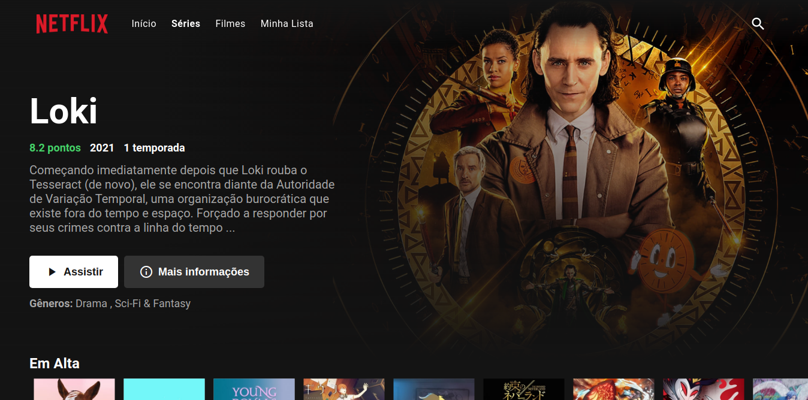

# Vuetflix
[28/08/2021]

Vuetlix is a Netflix clone using my personal API (https://github.com/custodiomatheus/Nodeflix) and TmdbAPI (https://www.themoviedb.org/documentation/api), in addition to registration and login part, it is possible to link many users to a account, to be able to add a favorite and view the series and movies watched (unfortunately it is not possible to actually watch it, but a very creative solution is being planned), it is also possible to search for some specific content.

[04/06/2024]

In this new version of Vuetflix, I decided to focus only on front-end and typescript, so I removed my personal API and I using only TmdbAPI (https://www.themoviedb.org/documentation/api. Login and register will happen only in front-end and multi-users feature has been removed, as well the favorite feature. But now the code is cleaner.

Maybe in the feature I can add these features back and I also need to add some unit, end-to-end and snapshot tests, but right now I'm focused on learning new technologies.

Now you can check vuetflix without download project, you can access:
https://heroic-chimera-842595.netlify.app

## How run the project?

### Requests
Have the NodeJs version v20.12.2 installed on your computer.
With the NodeJs installed, follow the steps below ;)

1. Clone the repository, you can dowload the .zip or use the follow command
```bash
git clone https://github.com/custodiomatheus/vuetflix.git
```
2. Access the project folder
```bash
cd vuetflix
```
3. Run the command below to install all project dependencies
```bash
pnpm install
```
PS: this can take a few seconds....

4. Run the command below to initialize the project
```bash
pnpm run dev
```
5. Last but not least, open some browser in the follow url
http://localhost:8080



## Technologies
* axios
* vue
* vue-router
* vuex
* vuex-persist
* typescript
* swiper
* vee-validate
* underscore

